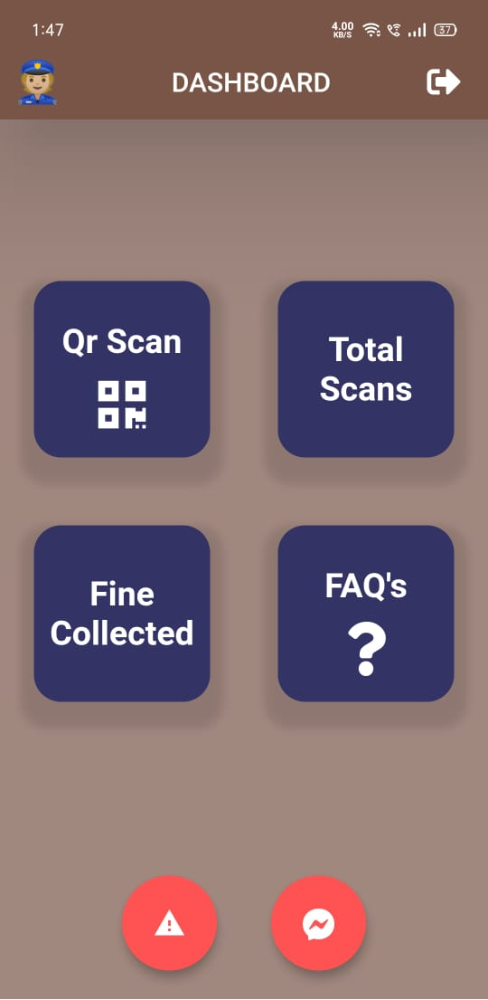
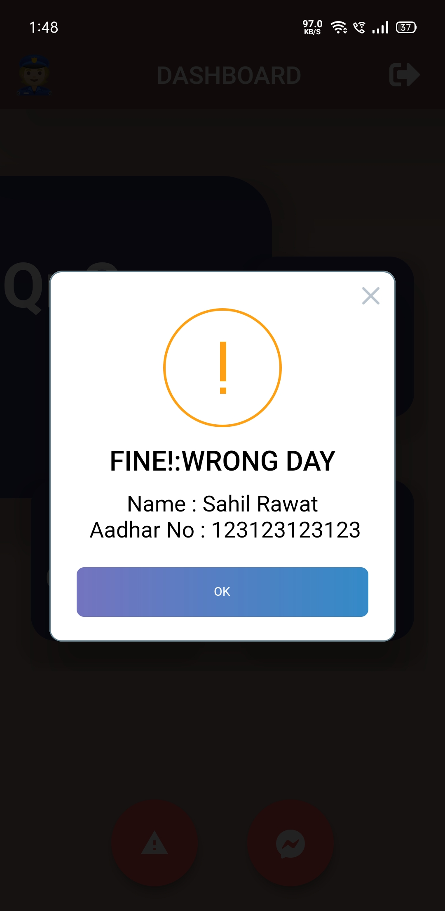
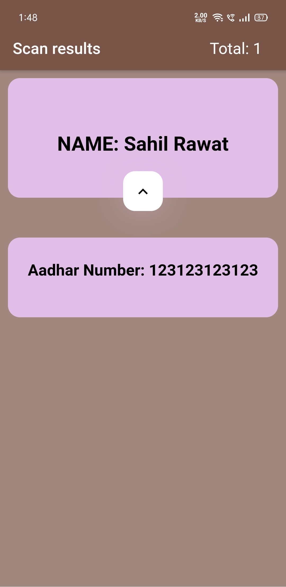
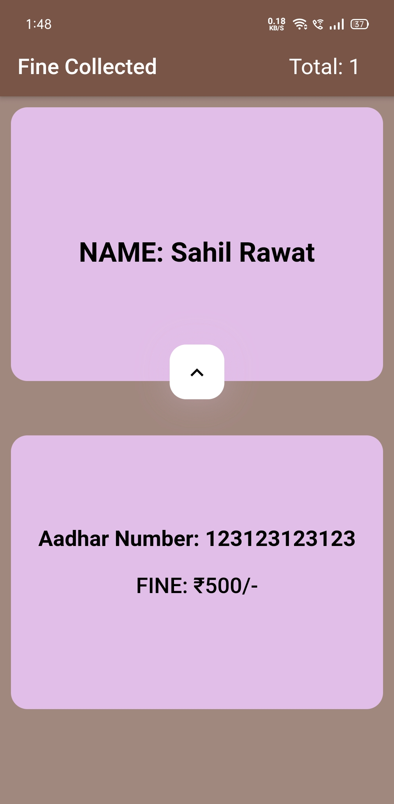
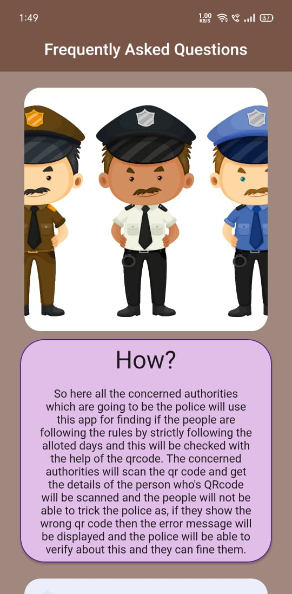
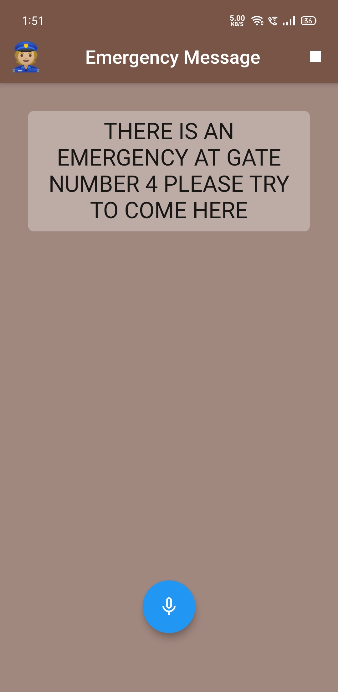

# [___Covid Busters___](https://covidbuster.herokuapp.com/)

---

### Table Of Content

- [Description](#description)
- [Visuals](#visuals)
- [Technologies](#technologies)
- [Installation](#installation)
- [Author and Acknowledgment](#author_acknowledgment)

## Description :

## Smart Way to Travel Post Covid-19

### Post Lockdown Public Transportation Management System

Our project is focusing on the current situation of covid 19. A Project solely for ensuring Peoples Saftey Post Covid-19 and to maintain social Distancing in more organized way.We Designed 2 Cross-Platform Application.

Firstly, For user Side where a user when registers on the app using his/her aadhar card ID he/she is allotted 3 Days of week The Person is allowed to go out on those particular days only, The App generates a Unique QR code for every user which is then Scanned by officials at the Public Transport Systems and If the person is allowed than the official allow them to board the public transport otherwise a fine is charged for not following the guidlines. This also ensures that no more than allowed people boards the public transport to ensure safety and social distancing within the Public Transport. This helps To reduce the crowd on Public Transportation Systems.

Secondly, For Authorities/Officials at the Public Transportation, This App Allowes the Officials to Scan the QR Code Generated by User App and if the Scanner verifies that the particular person is allowed on that day the official allows them to board the public Transport else the app automatically charges the fine from thatn user, This is to discourage the peoples not following guidelines.

---

## Visuals

For User Side Application

 
 
 
 
 

---

For Authority Side Application

 
 
 
 

---

For Covid Busters Website

## Technologies

The Techonlogies Used on Our Project are as follows

### Applicatoion

- Flutter - For Creating Cross Platform App
- FireBaseAuth - For Authentication Of Users
- FireBase Firestore - For Storing Data Related to application

### Website

- Html , CSS - For Creating Basic structure of Our website
- BootStrap - For creating impressive UI for our FrontEnd
- NodeJs-Express - For Backend of our Website
- JavaScript - For Functionality and algorithm Design

## Installation :

Instructions For Using

#### Andriod App :

- Requirements - Flutter SDK, Android Studio (or any IDE you preffer for devloping flutter Apps)
- Import the App Folder in Android Studio or your prefferable IDE
- Run `pub get` To install all dependency packages
- To get the APK -- Build APK from the Flutter Project or
- Get the APK

#### Website :

- Clone the Repo locally
- Open the Web/divider Folder
- Install NodeJs on your computer
- Open The folder in Terminal and enter `npm install` This will install all dependency packages
- Open Terminal and enter `npm start` To run the project on localhost
- Open The Browser and goto `127.0.0.1:8080` or `localhost:8080` (if the port is busy look in terminal the port no. and enter that replacing 3000) or
- Visit : https://covidbuster.herokuapp.com/

---

## *Author and Acknowledment :*

> ### Ninad Kanchan

- Flutter Devloper
- Devloped the USER-SIDE Covid Busters Application

---

> ### Siddhant Sharma

- Flutter Devloper
- Devloped the AUTHORITY-SIDE Covid Busters Application

---

> ### Sahil Singh Rawat

- Web Devloper
- Devloped the Covid Busters Website
